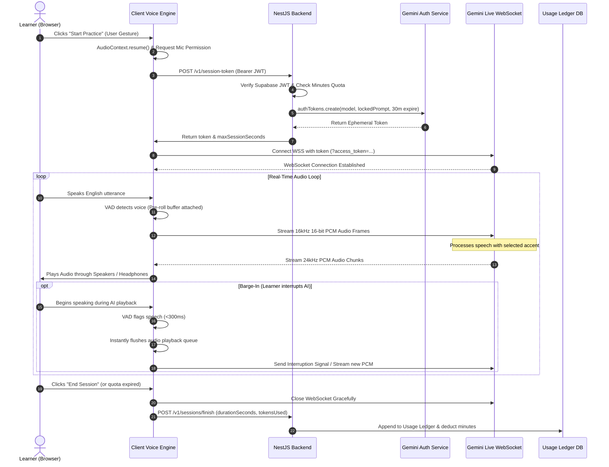

# System Architecture: Maya AI English Speaking Coach

*Comprehensive architectural specification with Mermaid diagrams per Master Prompt Section 4 (Phase 0).*

---

## 1. High-Level Architecture Overview

```mermaid
flowchart TB
    subgraph Client ["Universal Client (maya-frontend)"]
        direction TB
        UI["UI Layer (Expo Router + NativeWind)"]
        Shell["Responsive Shell (Phone / Tablet / Desktop)"]
        AudioEngine["Audio Engine (AudioWorklet + VAD + Player)"]
        WSTransport["LiveTransport (WebSocket Client)"]
        AuthClient["Supabase Auth Client"]
        
        UI --> Shell
        Shell --> AudioEngine
        AudioEngine --> WSTransport
    end

    subgraph Backend ["NestJS Backend API (maya-backend)"]
        direction TB
        Gateway["HTTP Controllers (ValidationPipe + Helmet)"]
        AuthGuard["SupabaseAuthGuard (JWT Verification)"]
        TokenService["Sessions & Token Minting Service"]
        QuotaService["Quotas & Rate Limiting Service"]
        LedgerService["Usage Ledger (Append-Only)"]
        HealthModule["Health & Liveness Module"]

        Gateway --> AuthGuard
        AuthGuard --> QuotaService
        QuotaService --> TokenService
        TokenService --> LedgerService
    end

    subgraph External ["External Cloud Services"]
        Supabase["Supabase Auth & Database"]
        GeminiLive["Google Gemini Live API (WebSockets)"]
        GeminiAuth["Google GenAI Auth Provisioning API"]
    end

    AuthClient <-->|User Auth / Session| Supabase
    Gateway <-->|JWT Verification| Supabase
    TokenService -->|Mint Ephemeral Token (Locked Config)| GeminiAuth
    WSTransport <==|Direct 16kHz PCM Audio Stream|==> GeminiLive
```

---

## 2. Real-Time Voice Session Sequence



---

## 3. Responsive Breakpoint Architecture

The UI adapts dynamically across three viewports:

| Breakpoint | Range | Navigation Pattern | Layout Architecture |
| :--- | :--- | :--- | :--- |
| **Phone** | `< 768 px` | Bottom navigation bar / mobile header | Single-column full-width container matching reference images. |
| **Tablet** | `768–1023 px` | Adaptive top navigation bar | Centered container ($\le 720\text{ px}$), multi-column tips/scenario cards. |
| **Desktop** | `≥ 1024 px` | Persistent side navigation bar | Constrained max-width ($\le 1200\text{ px}$), master-detail split (conversation + feedback/timer panel). |

---

## 4. Audio Engine Pipeline

```
[ Microphone Input (44.1 / 48 kHz) ]
                |
     { echoCancellation: true, noiseSuppression: true }
                v
[ AudioWorkletNode (Off Main Thread) ]
                |
       Downsample to 16 kHz PCM
                v
[ Client-Side VAD (Energy Detection + Pre-Roll) ]
       |                                   |
 (Voice Active)                     (Silence Detected)
       |                                   |
       v                                   v
[ Send PCM via WebSocket ]          [ Suppress Transmission (Zero Tokens) ]
```
